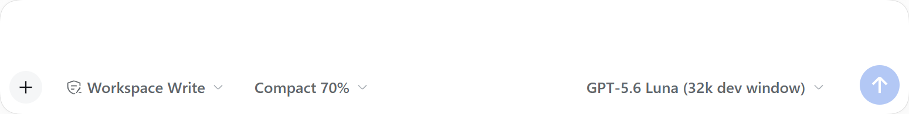
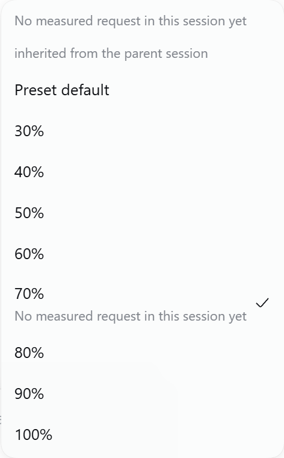

# dsh-compaction-threshold

**Per-session automatic compaction threshold for [DeepSeek Harness](https://github.com/deepseek-ai/deepseek-harness), adjustable from the Web composer while a session runs.**

The shipped backend (`@deepseek-ai/dsh-compaction-basic`) fixes the trigger
percentage in the agent preset: one number for every session that preset serves,
changeable only by editing YAML and reloading the host. That is the wrong
granularity for real work — a long refactor wants to compact late and keep its
history verbatim, a scratch session wants to compact early and stay cheap, and
neither should require a host restart.

This plugin keeps the same trigger arithmetic and makes the percentage **per
session**: a chip beside the permission and model chips shows the value, a menu
changes it in one click, `/compaction-threshold` does the same from the keyboard,
and the value is stored durably beside the session log so it survives a restart.
A forked session and a delegated subagent inherit their parent's value.

The package is **third-party**, and it is honest about its coupling: a compaction
backend must be a subclass of the shipped engine, so unlike a plugin that only
talks to the Cordis context, this one imports
`@deepseek-ai/dsh-compaction-basic` and copies its trigger policy. Read
[Known limitations](#known-limitations) before upgrading the harness.

- [What it looks like](#what-it-looks-like)
- [Quick start](#quick-start)
- [Use](#use)
- [Inheritance](#inheritance)
- [How it works](#how-it-works)
- [Model experience](#model-experience)
- [Verification](#verification)
- [Developing against a dev host](#developing-against-a-dev-host)
- [Known limitations](#known-limitations)

## What it looks like

The chip sits with the permission and model chips in the composer, and shows the
session's current percentage:



The menu offers the preset default and 30 %–100 %. Here the session is a fork
that inherited its parent's 70 %, so the menu also states where the value came
from:



Once a request has been measured, the chip's tooltip and the menu heading report
the percentage the trigger actually resolved to, so an inert setting (one above
the capacity cap) is visible rather than silent.

## Quick start

```sh
dsh plugin --profile web add github:windwhiterain/dsh-compaction-threshold
```

Then wire two rows into `~/.dsh/profiles/web/cordis.patch.yml` — one on the host
plane, one inside each agent preset that should become adjustable:

```yaml
# host plane: the durable store, the Session projection, and the command
- insert:
    - id: compaction-threshold
      name: 'dsh-compaction-threshold'

# agent plane: replace the shipped backend inside the preset's compaction group
#   - id: compaction-basic
#     name: '@deepseek-ai/dsh-compaction-basic'          # remove this row
#   ...and add:
#   - id: compaction-threshold-engine
#     name: 'dsh-compaction-threshold/engine'
```

Keep `command-compact` and `tool-result-pruner` exactly as they were. Omit
`thresholdRatio` on the engine row to follow the backend default (0.8); state it
to give that preset a different starting point.

**Restart the host afterwards.** A new dependency is read at startup, so the row
cannot resolve in the running process, and applying the preset swap before that
restart leaves new sessions mounting an unresolved row. `deploy/` holds the same
instructions as a checklist and a script that applies them structurally:

```sh
node deploy/apply-web-wiring.mjs ~/.dsh/profiles/web/cordis.patch.yml [--write]
```

## Use

The chip opens a menu of `Preset default` plus 30 %–100 %. The same change can be
typed:

| Input | Effect |
|---|---|
| `/compaction-threshold` | Report the current value, its origin, and the resolved trigger |
| `/compaction-threshold 60` or `60%` | Compact this session once pressure reaches 60 % of its window |
| `/compaction-threshold 0.6` | The same, written as a ratio (bare values ≤ 1 are ratios) |
| `/compaction-threshold default` | Drop the value and follow the preset again |

The change applies from the next step, is enforced against a turn already in
flight (the value is read at every step boundary), and survives a restart.

## Inheritance

A forked session and a delegated subagent both record their direct parent in
`SessionHeader.parentSession`, so both inherit. A child receives a **snapshot** of
the nearest ancestor that owns a value, up to 16 generations, and owns it from
then on:

| Situation | Result |
|---|---|
| Child's parent has 70 %, preset default 10 % | Child shows 70 %, marked `inherited from the parent session` |
| The parent had no value, its own parent had 25 % | Child inherits 25 % (nearest ancestor with a value) |
| The parent changes 70 % → 50 % after the child exists | Child keeps 70 %: the snapshot was taken once |
| Child's `/compaction-threshold default` | Child returns to the preset default and does **not** re-inherit |
| No ancestor owns a value | Child follows the preset default |

The record that carries a snapshot is also the marker that the inheritance was
spent, which is what keeps `default` meaningful in a child. The value is written
durably, and the chip keeps the origin visible until the child's own value
differs from the inherited one.

## How it works

Two rows, because a compaction backend and the interface that configures it live
on different planes:

| Row | Plane | Owns |
|---|---|---|
| `dsh-compaction-threshold` | Host | The storage domain keyed by Session id, the `compactionThreshold` Session projection, and the `/compaction-threshold` command |
| `dsh-compaction-threshold/engine` | Agent preset, inside its `compaction` group | The `ctx.compaction` service: the shipped engine with a per-session pressure ratio |

The engine reads the value synchronously from the host service and falls back to
its own configured `thresholdRatio` when the host row is absent, so a miswired
composition degrades to the shipped behaviour instead of disabling compaction.
Context-overflow recovery, retention, pruning, retries, and summarization are
inherited unchanged.

### The threshold formula

Unchanged from the shipped backend:

```
thresholdTokens = floor(min(contextWindow × ratio, contextWindow − outputReservation − headroomTokens))
```

Only `ratio` can come from the session. A ratio at or above
`(contextWindow − outputReservation − headroomTokens) / contextWindow` therefore
changes nothing: the capacity cap binds first, and the chip reports the resolved
trigger so that is visible rather than silent.

### Why the override lives in a storage domain, not the session log

The Session persistence reader refuses an event type outside the generated
known-type catalog unless the record carries `ignorable: true`
(`packages/session/session-persistence/src/storage-contract.ts`), and
`Session.append()` cannot set that marker. A plugin outside the harness
repository therefore cannot add a Session event: its own logs would stop loading.
The override is non-session application data, so it belongs in
`ctx.storageDomain`, and the client is notified through a Session projection —
which is key-addressed and needs no client code per domain.

## Model experience

### Per-session compaction threshold

#### What the model sees

Nothing directly: the plugin adds no tool and no prompt text. Indirectly it
changes when a `<compacted-summary>` checkpoint replaces older history and how
much recent history stays verbatim, exactly as the shipped backend does.

#### Token effect

Lowering a session's ratio compacts earlier and therefore spends fewer prompt
tokens per request at the cost of more summaries; raising it (up to the capacity
cap) compacts later. The summarization request itself is the same one the shipped
backend issues.

#### KV-cache effect

The summarization call reuses the conversation's own prefix, as the shipped
backend does. Changing the ratio never rewrites a request prefix, so it
invalidates no provider cache; it only changes which requests still carry the
un-compacted prefix.

## Verification

```sh
node probe/probe.mjs
```

The probe drives the pure policy module without a host: threshold arithmetic,
capacity caps, range selection, the command grammar, and the inheritance walk
(direct parent, ancestor skipping, unusable values, cycle safety, depth cap).
20 probes pass.

Two further probes need no browser: `probe/session-tools.mjs` decodes the
zstd-framed session logs and reports each stored session's preset, tool catalog,
and delegation depth, and `probe/tsx-identity.mjs` proves that a plugin outside
the checkout shares the host's `BasicCompactionEngine` and `Service` objects under
a source-launched host.

The browser probes drive the installed Edge through `playwright-core` and verify
against a dev host that the chip renders, the menu writes through the command,
the value is per session, `default` clears it, clearing does not re-inherit, a
fork inherits, and a delegated child inherits:

```sh
node probe/dev-ui.mjs http://127.0.0.1:3081/?token=…
node probe/dev-fork.mjs http://127.0.0.1:3081/?token=… 70
node probe/dev-subagent.mjs http://127.0.0.1:3081/?token=… 80
node probe/dev-chip.mjs http://127.0.0.1:3081/?token=… 4
```

## Developing against a dev host

A dev host is required to verify anything the client half renders, and it must
never share the primary host's port. A second host that inherits the default port
tries to bind the same address, and on Windows that second bind can take the
listener away from the running host — the running host then dies. Check the port
first, then boot with an explicit one:

```powershell
Get-NetTCPConnection -State Listen -LocalPort 3081 -ErrorAction SilentlyContinue   # expect nothing
./scripts/dev-host.ps1                      # DSH_HOME + profile + 127.0.0.1:3081 + --no-open
./scripts/dev-host.ps1 -Checkout C:/path/to/deepseek-harness   # boot from source through tsx
```

`scripts/dev-host.ps1` refuses the primary port, refuses a port that is already
listening, refuses `~/.dsh` as `DSH_HOME`, and binds loopback only. The three
isolations it guarantees:

| Resource | Primary host | Dev host |
|---|---|---|
| Port | the deployment's own port | explicit free port, `127.0.0.1` |
| `DSH_HOME` | `~/.dsh` | a separate directory |
| Browser | opened by the harness | `--no-open`, so no window steals focus |

Other rules that matter here:

- `--port 0` lets the OS assign a free port, which cannot collide at all.
- `--from-default-profile web` **boots** the profile it initializes; it is not an
  init-only switch. Pass the port flags in that same command.
- A profile's `cordis.patch.yml` is live-reloaded, but a **new dependency** is read
  at startup, so the dev host needs one restart after installing the plugin.
- Credentials live per home: copy `.credentials.yaml` into the dev home, or export
  the provider key in the environment before booting.
- File-level `hmr` roots reload the host half without a restart; after adding a
  root, touch the file once, because the watcher reacts to a change.

## Known limitations

- **Copied trigger policy.** The pressure branch, its formula, and the range
  selection are transcribed from `@deepseek-ai/dsh-compaction-basic`
  0.1.7-rc.1 (`src/config.ts`, `src/index.ts`, `src/region.ts`). Those internals
  are not exported, so an upstream change must be mirrored here by hand, and the
  `Config` schema is inherited from the installed package rather than owned. The
  probe pins the arithmetic, not upstream file contents.
- **The ratio cannot exceed the capacity cap.** With a large output reservation
  or headroom, high percentages are inert; the chip reports the resolved trigger
  so that is visible instead of silent.
- **A threshold cannot fix pressure that lives in the tool schemas.** Compaction
  is only attempted when the budget is crossed, and the transaction refuses a
  summary that is not smaller than the span it replaces. In a deployment whose
  declared window is barely larger than its own tool catalog, the engine prunes,
  tries a summary, and honestly reports
  `summary is not smaller than the shadowed content`. A ratio changes *when* the
  engine tries; it cannot create headroom the surface does not hold.
- **A snapshot is taken at the child's first observation, not at the fork.**
  The Session store emits no creation or fork event, so lineage is read from
  `SessionHeader.parentSession` and the copy happens the first time the child is
  read (the engine's pressure check or the projection). An ancestor that changes
  its value between the fork and that first observation is what the child
  inherits, and a child that owns no record yet still inherits a value its
  ancestor sets later; owning any record spends the inheritance for good.
- **A child inherits only where the engine is mounted.** A child keeps its
  parent's agent preset, so this holds for a preset that carries the engine row; a
  child of a preset still running the shipped backend has no chip and no
  inheritance.
- **The package declares no dependencies on purpose.** `@deepseek-ai/cordis`,
  `@deepseek-ai/dsh-compaction`, and `@deepseek-ai/dsh-compaction-basic` must
  resolve from the host, exactly like the shipped rows do; a `link:` or git
  install inside a DSH profile resolves them through that profile, so the plugin
  shares the host's module instances instead of loading a second copy of the
  engine and of `Service`. Running `import('dsh-compaction-threshold')` outside a
  host therefore fails on those specifiers, which is expected.
- **Records are never garbage-collected** when a session is deleted.
  `/compaction-threshold default` clears one session's value, and the whole
  domain can be dropped by deleting its storage unit file.
- **No storage domain means no persistence.** Without `ctx.storageDomain` the
  value lives in process memory only (the plugin logs one warning) and the engine
  keeps working.
- **A preset without the engine row shows no chip**, because no projection is
  published: the chip never offers a switch no backend would honour.
- **The chip renders beside the context meter, not inside it.** The built-in
  meter's popover has no extension slot, so the effective trigger is repeated in
  this chip's own tooltip and menu heading.

## License

MIT — see [LICENSE](LICENSE).
